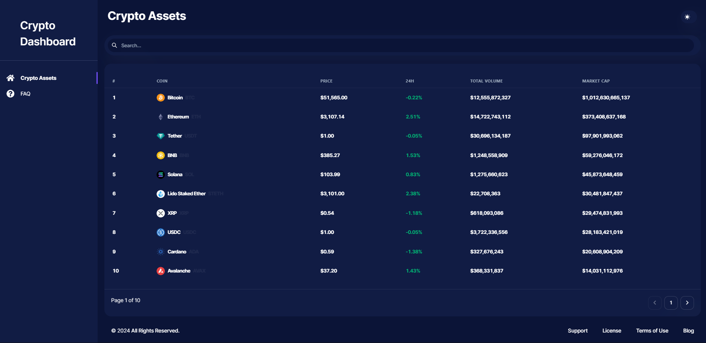
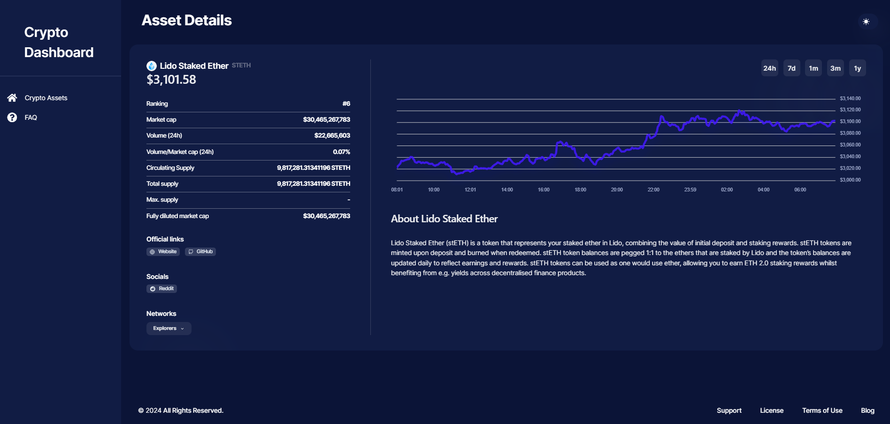

# Crypto Asset Report SaaS Platform

Welcome to the Crypto Asset Report SaaS Platform, a sophisticated web application designed to deliver in-depth reports on a wide range of cryptocurrency assets such as Bitcoin, Ethereum, and more. Our platform offers comprehensive narratives, data visualizations in the form of charts, captivating images, and seamless access to external resources through hyperlinks.

## Live Link

Experience our live application on Vercel. Click here to explore the platform.

## Screenshot

### Dashboard Page

### Details Page

## Technologies

The platform leverages cutting-edge technologies to provide a seamless user experience. I have utilized React with TypeScript and Vite for setting up the application infrastructure.

Presently, I have integrated two official plugins:

- @vitejs/plugin-react which utilizes Babel for Fast Refresh.
- @vitejs/plugin-react-swc which employs SWC for Fast Refresh.
Additionally, I have incorporated eslint-plugin-react for maintaining code quality and consistency.

## Setup

### Node Version

Ensure you have Node 18 (specifically version 18.16.0) installed along with yarn.

### Download or Clone the Repository

Clone or download the repository to get started.

## Environment Variables
To access the CoinGecko API, kindly sign up on their platform and obtain the API key. Create a .env file and add the following keys:

- VITE_CG_API_URL=
- VITE_X_CG_DEMO_API_KEY=

### Installation

Run the following command to install all the required packages:

`yarn`

To launch the application in the development mode, run:

`yarn dev`

Validate the code against eslint rules by running:

`yarn lint`

Generate a production-ready build by executing:

`yarn build`

## Usage Instructions

- Dashboard Tab: Explore a comprehensive table listing all available crypto assets.
- Questions Tab: Gain insights into frequently asked questions related to asset details.

